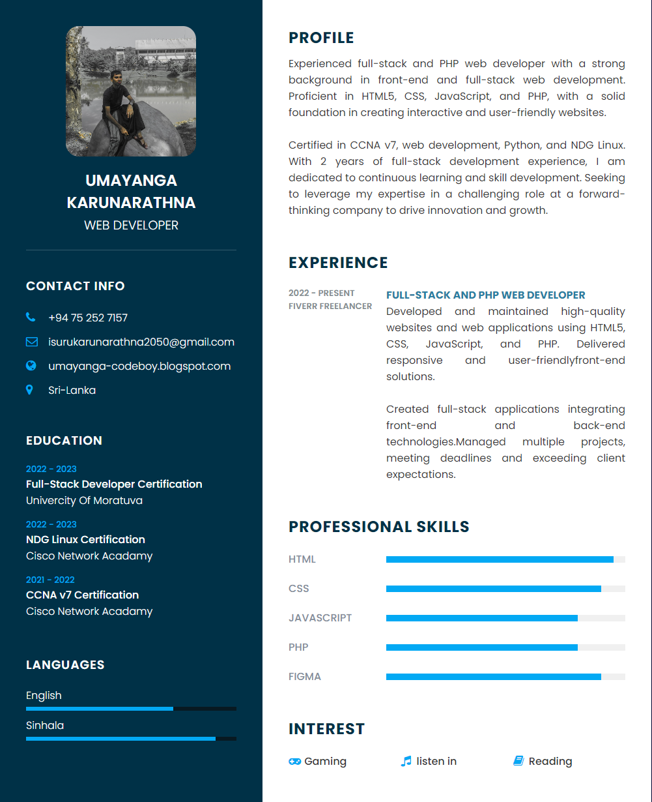

# CodeBoy-WebCV

A clean, modern, and responsive web-based CV template to showcase your personal profile, skills, and projects.

---

## 📸 Screenshot


---

## 🚀 Features

- Minimalistic and professional design
- Fully responsive layout for desktops, tablets, and mobile
- Easy customization with HTML & CSS
- Ideal for web CV or personal portfolio

---

## 🛠️ Installation

1. Clone the repository:

```bash
git clone https://github.com/umyanga2005/CodeBoy-WebCV.git
```

2. Navigate to the project folder:

```bash
cd CodeBoy-WebCV
```

3. Open `index.html` in your preferred browser to view your CV.

---

## 🎨 Customization

- Edit personal details directly in `index.html`
- Modify styles in `style.css` for colors, fonts, and layout
- Replace screenshot placeholders with your own images

---

## 📄 License

This project is licensed under the MIT License. See the [LICENSE](LICENSE) file for details.

---
